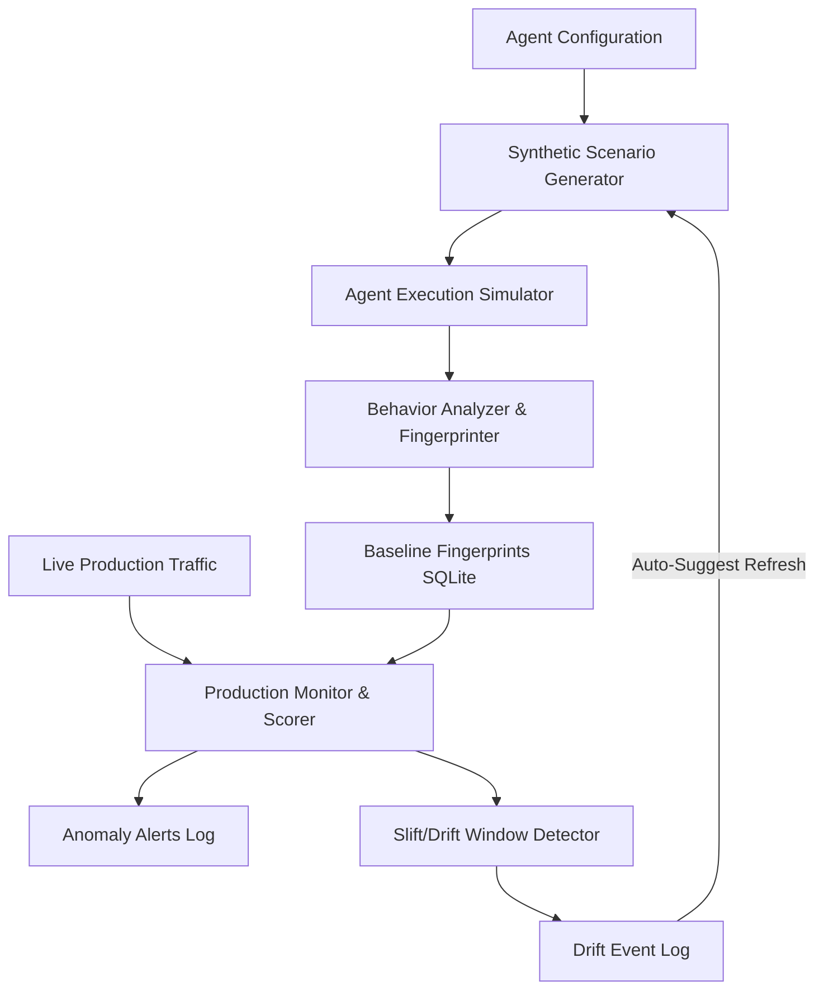

# PS-4.1 Agent Behavioral Baseline Builder

A complete, production-ready AI behavioral governance system designed to establish a statistical behavioral baseline (fingerprint) for an AI agent before production traffic, monitor live production traffic against that baseline, detect anomalies and version drift, and auto-recommend baseline updates.

This repository implements all requirements for **PS-4.1 (Parts 1 & 2)** including:
1. **Synthetic Scenario Generator** (generates 50+ diverse offline test cases).
2. **Baseline Recorder** (runs simulations, aggregates execution traces, computes fingerprints).
3. **Intent-Based Clustered Baselines** (maintains separate sub-baselines for Information Retrieval, Data Modification, and Communication).
4. **Production Monitor** (simulates live normal/anomalous traffic, scores sessions from 0 to 100).
5. **Explainable Anomaly Scoring** (provides transparent reasons for every warning/alert).
6. **Sliding-Window Drift Detector** (evaluates consistent behavior shifts and auto-recommends baseline refreshes).
7. **Interactive Monitoring Console** (10-page Streamlit console for visualization and sandbox testing).

---

## 📐 System Architecture

The project is built with a decoupled backend-frontend architecture:
- **Backend (FastAPI)**: REST API serving agent registration, scenario generation, simulation, scoring, alerts, and settings storage.
- **ORM (SQLAlchemy + SQLite)**: Relational database layer with automatic table creation storing agents, scenarios, traces, baseline fingerprints, production logs, settings, and alerts.
- **Governance Layer**: Services for statistical aggregation (`behavior_analyzer.py`) and sliding-window total variation distance calculation (`drift_detector.py`).
- **Dashboard (Streamlit)**: Responsive, visual management console utilizing Plotly for dynamic charts.



---

## 🛠️ Technology Stack

- **Language**: Python 3.11+
- **Backend Framework**: FastAPI, Uvicorn, Pydantic v2
- **Database / ORM**: SQLAlchemy 2.0, SQLite
- **Data Science**: Pandas, NumPy
- **Visualization**: Plotly
- **Testing**: Pytest, HTTPX

---

## 📁 Folder Structure

```
Agent-Behavioral-Baseline/
│
├── backend/
│   ├── __init__.py
│   ├── main.py                 # FastAPI Application Entrypoint
│   ├── database.py             # SQLite Engine & Session Configuration
│   ├── models.py               # SQLAlchemy Database Models
│   ├── schemas.py              # Pydantic Schemas & Validation
│   │
│   ├── api/
│   │   ├── __init__.py
│   │   ├── agents.py           # Agent registration & retrieval
│   │   ├── scenarios.py        # Scenario generation & retrieval
│   │   ├── baseline.py         # Baseline recording & fingerprints
│   │   ├── production.py       # Production session simulation
│   │   ├── monitor.py          # Summary statistics & drift metrics
│   │   ├── alerts.py           # Anomaly alerts query & resolution
│   │   └── health.py           # Health check endpoint
│   │
│   ├── services/
│   │   ├── __init__.py
│   │   ├── scenario_generator.py # Template-based test scenarios generator
│   │   ├── agent_simulator.py    # Offline agent executor (with profiles)
│   │   ├── baseline_recorder.py  # Orchestrates baseline v1/v2 creation
│   │   ├── behavior_analyzer.py  # Calculates fingerprint statistics & anomaly scores
│   │   └── drift_detector.py     # Sliding-window total variation distance drift detector
│   │
│   └── utils/
│       ├── __init__.py
│       └── statistics.py         # Mathematical helpers (mean, std dev, TVD)
│
├── dashboard/
│   ├── __init__.py
│   └── app.py                  # Streamlit Multi-Page Management Console
│
├── data/
│   └── agent_behavior.db       # Persistent SQLite Database File
│
├── tests/
│   ├── __init__.py
│   ├── test_backend.py         # Backend & Part 1 Unit Tests
│   ├── test_api.py             # API Integration Tests
│   └── test_part2.py           # Anomaly, Settings, Drift & Refresh Tests
│
├── requirements.txt            # Dependency Manifest
├── README.md                   # System Documentation
└── .gitignore                  # Git Ignore Configuration
```

---

## 🚀 Installation & Setup

### 1. Prerequisites
Ensure you have Python 3.11+ installed on your system.

### 2. Set Up Virtual Environment (Windows PowerShell)
```powershell
# Clone or navigate to the workspace
cd d:\Agent-Behavioral-Baseline

# Create virtual environment
python -m venv .venv

# Activate virtual environment
.venv\Scripts\Activate.ps1

# Upgrade pip
python -m pip install --upgrade pip

# Install dependencies
pip install -r requirements.txt
```

---

## 🏃 Running the Application

To run the complete system locally, open two terminal windows (with virtual environments activated):

### Term 1: Start FastAPI Backend
```powershell
.venv\Scripts\Activate.ps1
uvicorn backend.main:app --host 127.0.0.1 --port 8000 --reload
```
- API Docs (Swagger UI): [http://127.0.0.1:8000/docs](http://127.0.0.1:8000/docs)
- Health Check: [http://127.0.0.1:8000/api/health](http://127.0.0.1:8000/api/health)

### Term 2: Start Streamlit Dashboard
```powershell
.venv\Scripts\Activate.ps1
streamlit run dashboard/app.py
```
- Dashboard UI URL: [http://localhost:8501](http://localhost:8501)

---

## 🧪 Running Automated Tests

To run the complete test suite (14 robust unit and integration tests):
```powershell
.venv\Scripts\pytest -v
```

---

## 🛡️ How this Implementation Satisfies PS-4.1

| Challenge Requirement | Implemented Feature | Description | File Reference |
|---|---|---|---|
| **1. Synthetic scenario generator** | `ScenarioGenerator` service | Offline rule-based template generation utilizing agent prompts and tools to yield diverse, domain-specific tests. | [scenario_generator.py](file:///d:/Agent-Behavioral-Baseline/backend/services/scenario_generator.py) |
| **2. Exactly 50 scenarios** | Generator & API count validation | Defaults to generating exactly 50 scenarios. Input range validated `[1, 100]` in FastAPI schemas. | [schemas.py](file:///d:/Agent-Behavioral-Baseline/backend/schemas.py), [scenarios.py](file:///d:/Agent-Behavioral-Baseline/backend/api/scenarios.py) |
| **3. Intent Categories** | Intent classification | Categorizes scenarios and production traffic into: *Information Retrieval*, *Data Modification*, and *Communication*. | [scenario_generator.py](file:///d:/Agent-Behavioral-Baseline/backend/services/scenario_generator.py) |
| **4. Agent execution simulation** | `AgentSimulator` | Offline execution simulator supporting behavioral profiles: `normal`, `moderate_anomaly`, `severe_anomaly`, and `drift`. | [agent_simulator.py](file:///d:/Agent-Behavioral-Baseline/backend/services/agent_simulator.py) |
| **5. Behavioral fingerprint** | `BehaviorAnalyzer` aggregates | Computes distributions (tools, sequences, data access, intents) and statistics (response length, latency, success/error rates). | [behavior_analyzer.py](file:///d:/Agent-Behavioral-Baseline/backend/services/behavior_analyzer.py) |
| **6. SQLite Database Persistence** | SQLAlchemy tables | Persists agents, scenarios, traces, baselines, fingerprints, production logs, alerts, settings, and drift history in SQLite. | [models.py](file:///d:/Agent-Behavioral-Baseline/backend/models.py) |
| **7. Production Monitor & Scorer** | Anomaly scorer (0-100) | Computes a weighted deviation average of tool usage, sequence paths, latency, length, data access, and errors. | [behavior_analyzer.py](file:///d:/Agent-Behavioral-Baseline/backend/services/behavior_analyzer.py#L80) |
| **8. Configurable Thresholds** | `MonitoringSettings` table | Persists and applies customizable Warning (default 30) and Alert (default 60) thresholds and scoring weights. | [models.py](file:///d:/Agent-Behavioral-Baseline/backend/models.py), [settings.py](file:///d:/Agent-Behavioral-Baseline/backend/api/settings.py) |
| **9. Session-Level Explanations** | Explainable scoring outputs | Generates bullet-point explanations highlighting exact causes (e.g. "Response length 2.4x baseline average"). | [behavior_analyzer.py](file:///d:/Agent-Behavioral-Baseline/backend/services/behavior_analyzer.py#L91), [production_simulator.py](file:///d:/Agent-Behavioral-Baseline/backend/services/production_simulator.py) |
| **10. Sliding-Window Drift Detector** | Total Variation Distance (TVD) | Evaluates a sliding window of the last 20 production sessions. Computes TVD shifts to detect consistent drift (> 0.25). | [drift_detector.py](file:///d:/Agent-Behavioral-Baseline/backend/services/drift_detector.py) |
| **11. Model Update Simulation** | `drift` simulator profile | Simulates a prompt/model update to `agent-model-v2` and `prompt v2` which changes behavioral patterns to induce drift. | [agent_simulator.py](file:///d:/Agent-Behavioral-Baseline/backend/services/agent_simulator.py), [production_simulator.py](file:///d:/Agent-Behavioral-Baseline/backend/services/production_simulator.py) |
| **12. Auto Baseline Refresh** | Re-baselining workflow | When drift is detected, UI recommends refresh. Clicking `REFRESH BASELINE` updates scenarios and creates Baseline v2. | [baseline_recorder.py](file:///d:/Agent-Behavioral-Baseline/backend/services/baseline_recorder.py), [app.py](file:///d:/Agent-Behavioral-Baseline/dashboard/app.py) |
| **13. Intent Clustered Baselines** | Sub-baselines clustering | Groups traces by intent and creates separate sub-fingerprints. Evaluates incoming sessions against matching sub-baselines. | [baseline_recorder.py](file:///d:/Agent-Behavioral-Baseline/backend/services/baseline_recorder.py#L101), [production_simulator.py](file:///d:/Agent-Behavioral-Baseline/backend/services/production_simulator.py#L90) |
| **14. Console Dashboard** | 10-page visual console | Integrated navigation featuring Overview trends, session inspection, alert management, drift charts, settings weights, and tests. | [app.py](file:///d:/Agent-Behavioral-Baseline/dashboard/app.py) |
| **15. Automated Test Suite** | 14 Pytest tests | Automated coverage of agent registration, scenarios, fingerprints, scoring, alerts lifecycle, drift logic, and re-baselining. | [test_backend.py](file:///d:/Agent-Behavioral-Baseline/tests/test_backend.py), [test_api.py](file:///d:/Agent-Behavioral-Baseline/tests/test_api.py), [test_part2.py](file:///d:/Agent-Behavioral-Baseline/tests/test_part2.py) |

---

## 📖 Key Concepts Explained

### 1. Behavioral Fingerprint
A behavioral fingerprint represents the expected normal signature of the agent. It is a collection of statistical bounds gathered from running 50 synthetic scenarios:
- **Relative Frequencies**: Frequencies of individual tool calls (e.g. `search_database: 45%`) and transition sequences (e.g. `search_database -> get_customer: 30%`).
- **Data Categories**: Frequencies of data groups accessed.
- **Gaussian Bounds**: Average ($\mu$) and standard deviation ($\sigma$) of latency and response text length.

### 2. Anomaly Scoring (0–100)
Every production session is scored dynamically by comparing its execution trace with the active baseline:
- If a tool, sequence, data category, or intent is executed that is absent or extremely rare in the baseline, a deviation of $1.0$ (100%) is added for that metric.
- Latency and response length are assessed using Z-scores: $z = |x - \mu| / \sigma$. Z-scores above 2.0 indicate deviation, and Z-scores above 3.0 map to maximum deviation (1.0).
- If execution fails or has errors, error deviation is set.
- Deviations are multiplied by weights configured in Settings (e.g. error rate and data access have higher weights) and averaged to yield a score from 0 to 100.

### 3. Baseline Drift & Refresh Suggestion
Model drift occurs when the agent's behavior shifts permanently (e.g., due to a model version upgrade or prompt update).
- A **sliding window** of the last 20 sessions is aggregated into a temporary fingerprint.
- We measure the distance (Total Variation Distance) between the baseline distributions and this window.
- If the overall Drift Score exceeds the threshold (e.g. 0.25) consistently across the window, drift is detected. A single outlier anomaly does not trigger drift since it only changes the average by 5%, whereas a model update affects all 20 sessions in the window, pushing the score past the 25% threshold.
- The UI triggers a warning prompting the operator to **Refresh Baseline**, creating a new version in SQLite while archiving the old baseline for history.
